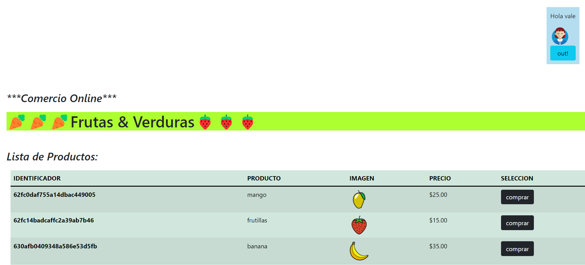

# Proyecto Final 
## Clase Backend 2022 - Comision 20645

### Comercio Online - :corn: Venta de Frutas y Verduras.:watermelon:
- - -

Comercio Onlines es una app que funciona como un e-commerce. 
En ella podemos iniciar sesión, ver listado de productos, seleccionarlos y avisar al proveedor de la compra. 
* * *

(toque la imagen para ver el video)
[](https://youtu.be/rEBTVI7fXnE)
* * *
#### Descripcion de la App: 
* Iniciamos sesión, o nos registramos al abrir el navegador. 
* Al registrarnos, enviamos la información al proveedor con los detalles del usuario nuevo. 
* Una vez loggeado, nos conducirá al index de la página, donde veremos: 
    - listado de productos,
    - sección carrito,
    - sección chat
* Podemos seleccionar el producto e ingresarlo a nuestro carrito.
* En la sección carrito nos informa: id del carrito y detalle de el/los productos seleccionados.
* Una vez terminada la selección, finalizamos la compra apretando el botón.
* Al finalizar la compra, se envia:
    - un mail al proveedor con los detalles de la compra, 
    - se genera una orden de compra, la cual queda guardada en base de datos, 
    - se envía un whatsapp al proveedor con el aviso de compra, 
    - se envía un SMS al cliente avisando que la compra esta en proceso.
* Al hacer logout, finalizamos la sesión y el carrito se elimina también.

* * *
#### Tecnologias utilizadas: 
* Node.js con framework Express
* Base de datos: Mongodb con ORM Mongoose & Connect-Mongo
* Base de dato en la nube: Mongo-ATLAS
* Vista: Express-handlebars
* Autenticacion: Passport __no use JWT (avisado al profesor)__
* Chat en tiempo real: Websocket con Socket.io (mensajes se guardan en MongoDB)
* Email: Nodemailer
* Mensajes texto: Twilio (recuerde activar whatsapp enviando un mensaje a twillio "Join ride-guide")
* Sesion: Express-Session 
* Cookies: Cookie-parser (duracion 1hora)
* Loggs: Log4js

* * *
#### Implementacion Rutas: 
* ##### 👤 Usuario: 
    Ingreso y registro de usuario desde __Vistas Handlebars__: 
    Por favor, dirigirse a __http://localhost:8080__ para probarlo.
    - __POST__: http://localhost:8080/ → "passport" autentica los datos, y si existen mail y contraseña, dan acceso al index.
    - __GET__: http://localhost:8080/login_error → vista para error de loggeo. 
    - __POST__: http://localhost:8080/register → para el posteo de registro 
    - __GET__: http://localhost:8080/index → se envian todos los datos a la vista index.hbs para renderizarlos en sus respectivos partials. 
    - __GET__: http://localhost:8080/enviarMensajes → al finalizar la compra, se envian todos los datos por esta ruta al clicker boton "finalizarCompra". 
    Se envian los mails, los mensajes de texto, y se elimina el carrito. 
    __se utilizan los métodos de "service" de carrito, productos y user__
    - __GET__: http://localhost:8080/logout → se destruye la sesión y se vuelve a la vista login.hbs

* ##### 🍒 Productos: 
    Muestro, ingreso, modifico y elimino con __"Postman"__. 
    Rutas: 
    - __GET__: http://localhost:8080/api/productos
    - __GET__: http://localhost:8080/api/productos/630afb2d09348a586e53d604 (ejemplo de id)
    - __POST__: http://localhost:8080/api/productos
    - __PUT__: http://localhost:8080/api/productos/62fc0daf755a14dbac449005 (ejemplo de id)
    - __DELETE__: http://localhost:8080/api/productos/630afa5309348a586e53d5e3 (ejemplo de id)

    Vista:
    - __VISTA INDEX.HBS__: renderizo mis productos.

* ##### 🛒 Carrito: 
    Creo, ingreso y elimino carrito desde las __Vistas handlebars__.
    Por favor, ingrese sesión __http://localhost:8080__ 
    - __BOTON COMPRAR__: se crea carrito nuevo y se ingesa producto (ruta POST /api/carrito/{{this._id}})
    - __GET__: http://localhost:8080/api/carrito → muestro todo mi carrito. (lo renderizo en vista index.hbs)
    - __BOTON ELIMINAR__: elimina producto por unidad (ruta DELETE /api/carrito/deleteProducto/{{this._id}})
    - __BOTON LOGOUT__: cierra sesión y se elimina carrito (ruta GET /logout)

* ##### ✉️ Mensajes: 
    Los mensajes se crean y se postean en la __Vista handlebars__. 
    - __POST__: http://localhost:8080/mensajes → posteamos los mensajes ingresados en el input de "chat.hbs".
    - __GET__: http://localhost:8080/mostrarMensajes → mostramos los mensajes y los renderizamos en "index.hbs" donde se encuentra el partial "chat.respuestas.hbs".
    - __GET__:http://localhost:8080/mensajes/:email → aqui podemos ver los mensajes por email. __esta ruta no la implemente, solo la puedo usar en postman__

* * *
#### Clonar y usar: 
```
git clone https://github.com/vueno1/proyectoFinalUenoBackend.git
npm install 
npm start
```

* * *
#### Autora: 
```
Ueno Valeria Soledad 
Email: ueno.vale@gmail.com
LinkedIn: https://www.linkedin.com/in/valeria-ueno-996a61210/
```

* * *
Muchas gracias por su visita! 😊